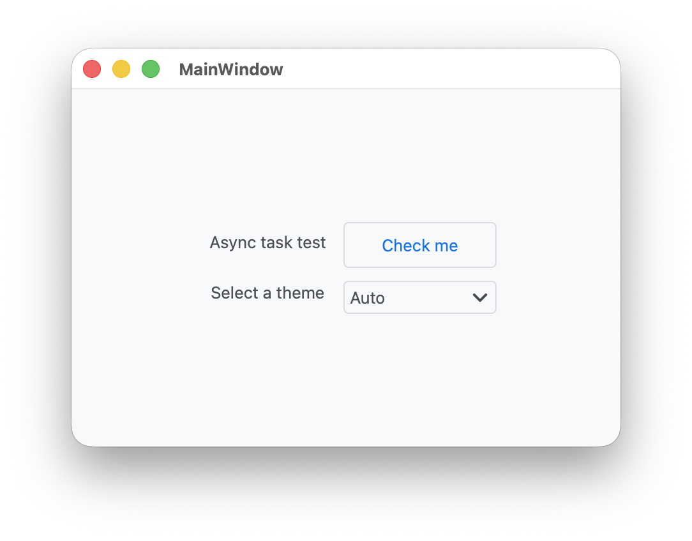
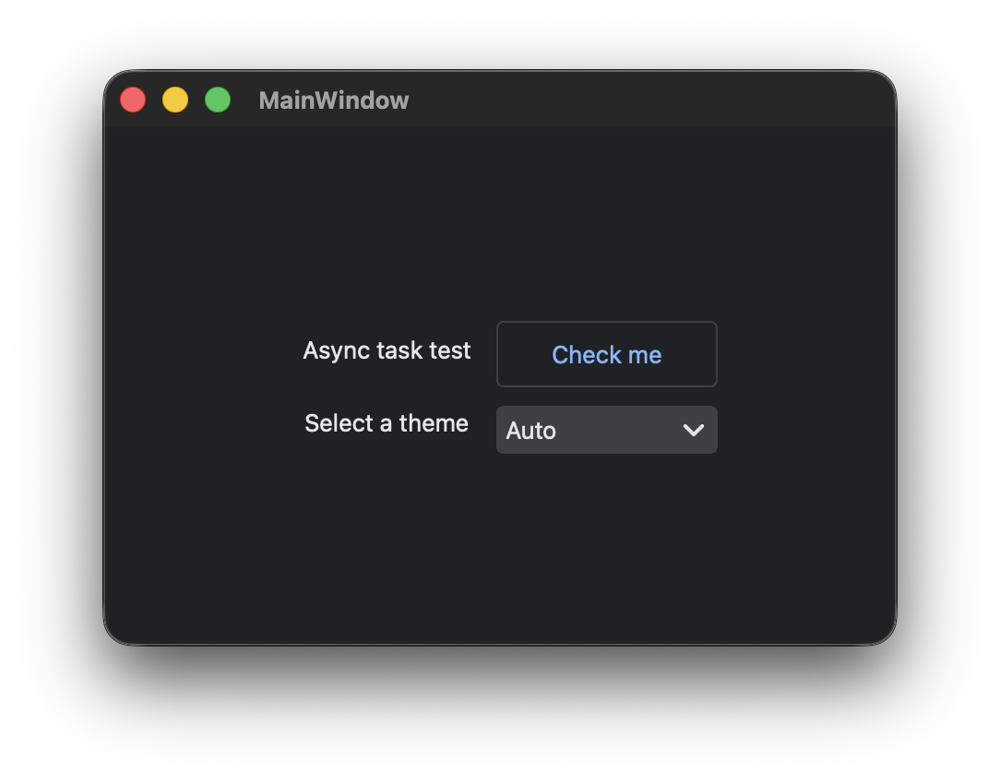

# PySide6 Project Template

Easy to use template for PySide6 projects.
This template is designed to help you get started with PySide6 quickly and easily.
It includes a basic project structure, a build script, and a pyproject file.

Even if some company computers are underpowered, they're still usable in most cases.
You just need to install uv and Python 3.8.

<p align="center">
  
  
  <br>
  <i>default theme preview</i>
</p>

## Main Dependencies

- pyside-cli
- PySide6
- qasync
- httpx
- PyQtDarkTheme
- Nuitka
- pytest

## Project Structure

| File or Directory            | Description                                  |
|------------------------------|----------------------------------------------|
| .cache/assets.json           | Build Caches                                 |
| .gitlab-ci.yml               | GitLab auto release script                   |
| .github/workflow/release.yml | GitHub auto release script                   |
| app/                         | Source code directory                        |
| app/assets/**                | Qt resources files (images, icons, etc.)     |
| app/i18n/*.ts                | Qt I18N's *.ts files                         |
| app/resources/*.py           | Generated Python files from UI and QRC files |
| app/ui/**.ui                 | Qt Designer UI files                         |
| build/                       | Build destination directory                  |
| CHANGE.md                    | Release notes for CI/CD                      |
| pyproject.toml               | Project builds and settings                  |
| qml_demo                     | See [qml_demo/README.md](qml_demo/README.md) |

## Project Setup and Usage

<p align="center">
  
  <br>
  <i>build via pyside-cli</i>
</p>

### Create your project

I recommend using [**pyside-cli**](https://github.com/SHIINASAMA/pys-cli) 
to create your project, for example:

```bash
pip install pyside-cli
pyside-cli --create your_project
```

### IDE/Editor Support

- IDEA (PyCharm, CLion, etc.)

- Microsoft Visual Studio Code

### Command

You also can use the command line to run the project.

- Setup development environment.

    ```bash
    uv sync
    ```

- Using QtDesigner to create UI files. The UI files are must have located in the `ui` folder.

    ```bash
    uv run pyside6-designer app/ui/main_window.ui
    ```

- How to build and package the project. Run the following command to get the help message:

    ```bash
    uv run pyside-cli -h
    ```

- Run test in command line:

    ```bash
    uv run pyside-cli --test
    ```

  Or use your environment file to run the app:

    ```bash
    uv run pyside-cli --rc
    uv run --env-file .env -- python -m app
    ``` 

## Others

- [Release and Product Version Control](docs/publish.md)
- [Internationalization](docs/i18n.md)
- [Windows 7 Compatibility](docs/windows7.md)